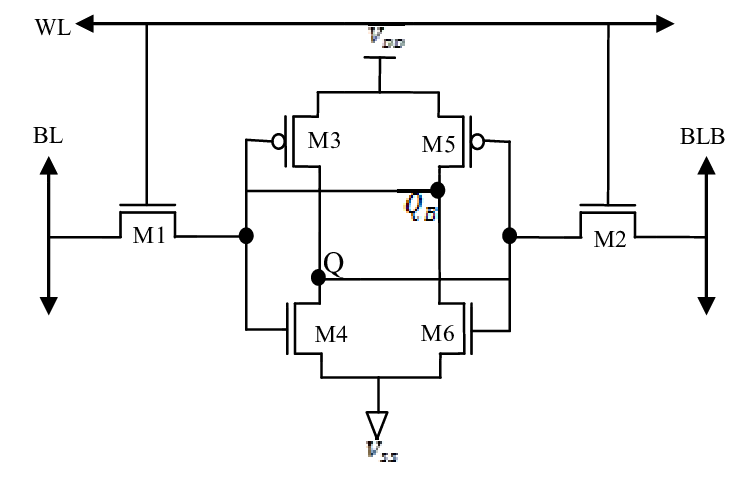
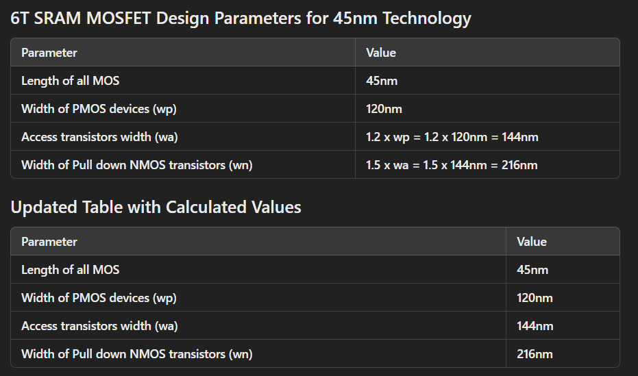
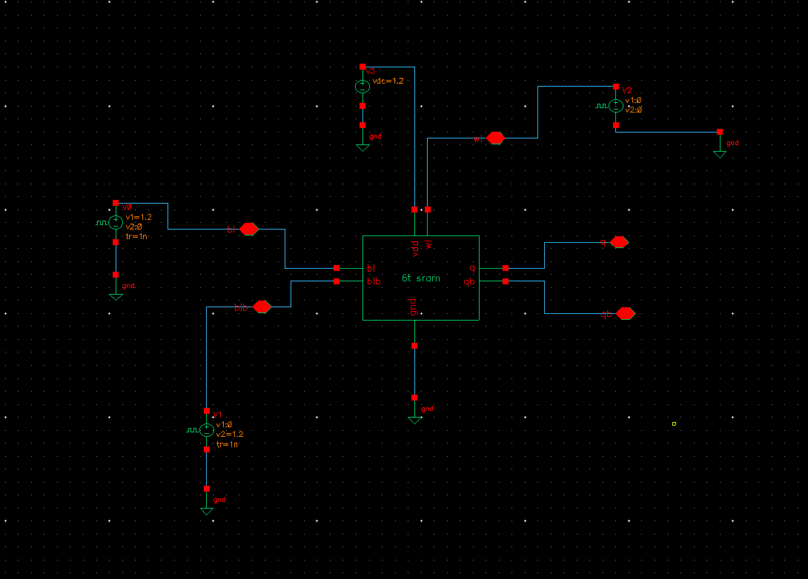
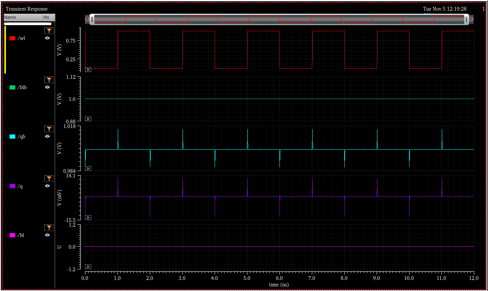
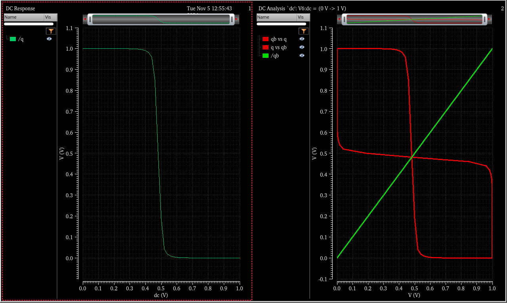
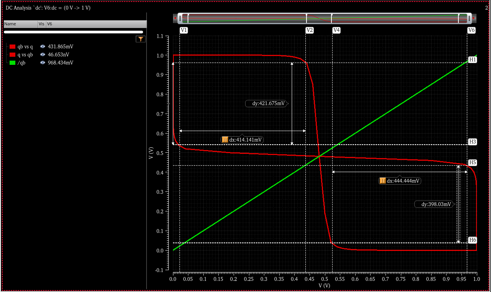
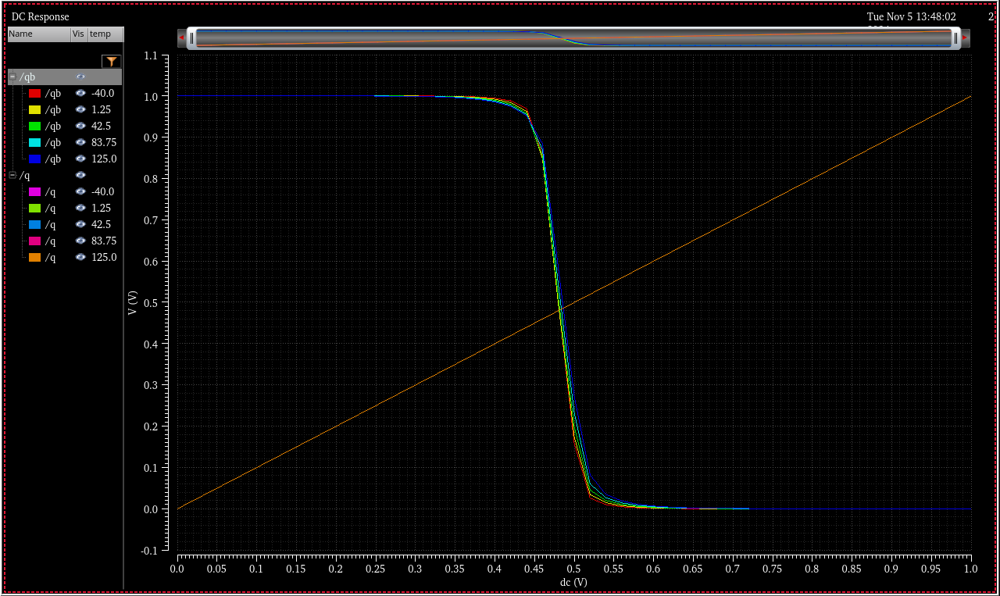
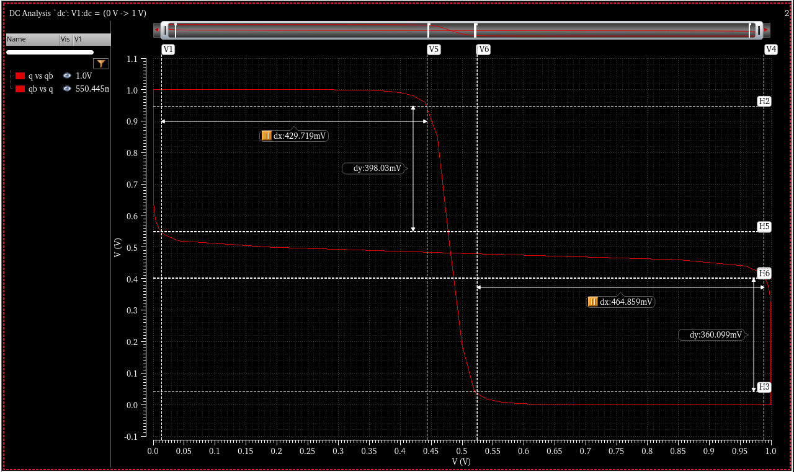

# 6T SRAM Analysis

## What is SRAM?

**SRAM (Static Random Access Memory)** is a type of volatile memory that stores data using flip-flops, which do not require refreshing. Unlike **DRAM (Dynamic RAM)**, which stores data in capacitors that need periodic refreshing, SRAM is faster and more reliable for read and write operations. However, SRAM is typically more expensive and has a lower storage density compared to DRAM. SRAM is commonly used in applications requiring high-speed data access, such as cache memory in processors.

## What is a 6T SRAM Cell?

The **6T SRAM cell** is a widely used memory cell in SRAM design, consisting of **six transistors**—four **NMOS** and two **PMOS**. These transistors form a stable latch that can store one bit of data. The key advantage of the 6T SRAM design is its simplicity and stability in storing data, making it an ideal choice for high-speed memory applications.

### Structure of a 6T SRAM Cell
- **Transistors**: 2 **PMOS** and 4 **NMOS** transistors.
- **Stable Latch**: The transistors form a cross-coupled inverter structure that enables the SRAM cell to store data without needing periodic refreshing, unlike DRAM cells.
- **Read and Write Operations**: Data can be read from or written to the SRAM cell through appropriate control signals.

  
*Figure 1: Basic structure of a 6T SRAM cell. The two inverters formed by cross-coupling the PMOS and NMOS transistors create the storage element.*

## Key Features of 6T SRAM
- **No Refreshing**: Unlike DRAM, 6T SRAM does not require refreshing cycles to maintain stored data.
- **Fast Access**: Provides faster read and write access times.
- **Low Power Consumption**: The design is optimized for low power usage, making it ideal for use in mobile devices and embedded systems.
- **High Reliability**: The 6T SRAM cell is known for its stable operation under a wide range of voltage and temperature conditions.

## Transistor Sizing for 6T SRAM (45nm Technology)

## Testbench for 6T SRAM

To verify the functionality and performance of the 6T SRAM cell, a **testbench** was created in **Cadence Virtuoso**. The testbench simulates the **read** and **write** operations of the SRAM cell under various conditions, allowing for the analysis of stability, power consumption, and timing characteristics.

### Description of Testbench

- **Write Operation**: The testbench applies a series of write signals to the SRAM cell, testing its ability to store data correctly.
- **Read Operation**: The testbench then applies read signals to check if the stored data can be retrieved accurately.
- **Corner Cases**: Various corner cases are tested, such as extreme voltage conditions, to ensure that the SRAM cell operates reliably.

  
*Figure 2: Testbench for the 6T SRAM cell. This setup simulates read and write operations to verify the cell’s functionality.*

The testbench helps in identifying issues like **write stability**, **read stability**, and **power consumption** under typical and extreme conditions. By analyzing the results, we can fine-tune the transistor sizing and layout for better performance and reliability.

## Testbench Simulation Results

After running the testbench for the 6T SRAM cell, the simulation results were obtained to evaluate the **read stability**, **write margin**, and **power consumption**. The results provide insight into the SRAM's performance under different conditions and are essential for verifying the functionality of the SRAM design.

### Simulation Highlights
- **Read Stability**: Shows the SRAM cell's ability to maintain data integrity during a read operation.
- **Write Margin**: The difference between the voltage levels for successful writing and failure, indicating the SRAM cell's robustness.
- **Power Consumption**: Analysis of the SRAM cell’s power usage during idle and active states.

  
*Figure 3: Simulation results for the 6T SRAM testbench. The waveform shows the read and write operations, highlighting the cell’s stability and power consumption.*

The simulation provides valuable data for understanding the SRAM cell's behavior, enabling optimizations for **speed**, **power efficiency**, and **reliability**.

## DC Response and DC Analysis

The **DC Analysis** of the 6T SRAM cell is crucial for understanding the behavior of the SRAM cell under steady-state conditions. This analysis helps to determine the **stability** of the cell, particularly the **read and write margins**, and ensures that the SRAM cell operates correctly within the desired voltage range.

### DC Response Analysis

The **DC Response** provides the voltage transfer characteristics of the SRAM cell. By analyzing the DC response, we can assess how the cell reacts to various input voltages and ensure that the bitlines maintain proper logic levels during read and write operations.

- **Read Margin**: Ensures that the SRAM cell can successfully output the correct data.
- **Write Margin**: Determines the ability to write new data into the cell without causing instability.

  
*Figure 4: DC response analysis of the 6T SRAM cell. The graph shows the voltage transfer characteristics and helps in evaluating the read and write margins.*

### DC Analysis

The **DC analysis** allows us to verify the **static operating point** of the SRAM cell under different conditions. It helps to evaluate the **voltage levels** at which the SRAM cell is stable, and it aids in optimizing the sizing of transistors for better power efficiency and reliability.

By analyzing the DC response and running DC analysis, we can ensure that the SRAM cell performs optimally with minimal power consumption.

## Butterfly Curve and Read State Delay Analysis

The **butterfly curve** is a key tool for analyzing the **read stability** of the SRAM cell. It shows the relationship between the **storage node voltage** and the **bitline voltage** during read operations, highlighting the **stability** and **robustness** of the cell. A well-formed butterfly curve indicates that the SRAM cell can reliably store data under read conditions without causing data corruption.

### Butterfly Curve Analysis

- **Stability**: The curve indicates the **read stability** of the SRAM cell. A larger distance between the two curves suggests better data retention during read operations.
- **Read Margin**: The distance between the two curves at the storage node voltage provides the **read margin**, showing how easily the data can be read without interference.

  
*Figure 5: Butterfly curve showing the read stability of the 6T SRAM cell. The curve represents the relationship between the storage node and bitline voltage during a read operation.*

### Read State Delay Analysis

The **read delay** is also a crucial performance parameter for SRAM cells, indicating the time taken to read the stored data. A shorter read delay is essential for improving access times in high-speed applications. The **butterfly curve** also helps to analyze the **delay** in the read state, ensuring that the SRAM cell operates within the required timing constraints.

By analyzing the butterfly curve and the read delay, we can optimize the SRAM cell design for high-speed and low-power performance.

## DC Response of 6T SRAM (Temperature Variation)

In the **DC Response** analysis of the 6T SRAM, we observe **five different voltage lines** for both the **storage node (Q)** and the complementary node **(QB)**. These lines correspond to the **voltage behavior of Q and QB** under **different temperature conditions**. Temperature variation significantly impacts the performance of SRAM cells, and this analysis helps evaluate how stable the cell is across a range of temperatures.

### Explanation of the 5 Lines for Q and 5 Lines for QB

- **5Q**: These five lines represent the voltage levels at the **storage node (Q)** under **five different temperature conditions**. The temperature variations help assess how temperature affects the stability of the stored bit.
- **5QB**: Similarly, the five lines for **QB** represent the complementary node voltages across the same set of temperature variations.

By analyzing these multiple voltage levels, we can determine:

- **Temperature Sensitivity**: How the SRAM cell behaves under different temperature conditions.
- **Voltage Margins**: The spread between the lines helps evaluate the **read** and **write margins** at varying temperatures.
- **Stability**: Ensuring that the SRAM cell remains stable across a wide range of temperature conditions.

  
*Figure 6: DC response analysis showing five voltage lines for the 6T SRAM's storage node (Q) and complementary node (QB) under different temperature conditions. This analysis helps evaluate the stability and performance of the SRAM cell at varying temperatures.*

This **DC Response** analysis under temperature variation is crucial for ensuring that the SRAM cell will operate reliably across a range of environmental conditions.

## Hold State Butterfly Curve

The **hold state** refers to the SRAM cell's behavior when no active read or write operation is taking place. During this state, the SRAM cell must maintain the stored value without changing or being disturbed. The **hold state butterfly curve** is crucial in ensuring that the stored value remains intact and that the cell does not flip its data due to noise or instability.

The **hold state butterfly curve** is similar to the read state curve, but it represents the condition where the bitline is not being actively driven, and the cell is in a stable state.

### Explanation of the Hold State Butterfly Curve

- The curve shows the relationship between the **storage node voltage (Q)** and the **bitline voltage** during the **hold state**.
- A **larger distance between the curves** indicates that the cell has a **larger hold margin**, meaning it is more robust against disturbances.
- A **well-formed curve** demonstrates that the stored value will not change due to small voltage fluctuations or noise.

  
*Figure 7: Butterfly curve for the hold state showing the stability of the 6T SRAM cell’s storage node (Q) and complementary node (QB) during the hold state. The curve ensures the data is maintained without any flipping or disturbance.*

### Significance of Hold State Stability

- **Data Integrity**: The curve ensures that the stored data remains intact during idle periods, without any unintended changes.
- **Noise Immunity**: A strong butterfly curve indicates that the SRAM cell is robust against noise and voltage fluctuations, which could otherwise cause data corruption.

This analysis is essential for ensuring the reliability and performance of SRAM cells, especially when there are no active operations being performed on them.

